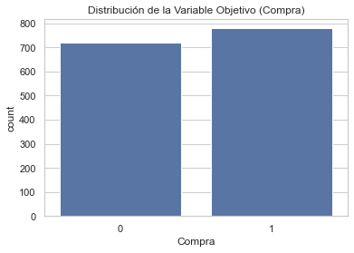
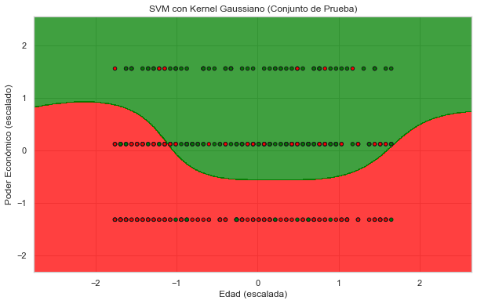

# Proyecto de Clasificación de Ventas de Coche con SVM

## Tabla de Contenidos

- [Descripción](#descripción)
- [Tecnologías Utilizadas](#tecnologías-utilizadas)
- [Instalación](#instalación)
- [Uso](#uso)
  - [1. Creación del Dataset](#1-creación-del-dataset)
  - [2. Procesamiento y Modelado](#2-procesamiento-y-modelado)
- [Análisis de Resultados](#análisis-de-resultados)
  - [1. Descripción del Dataset](#1-descripción-del-dataset)
  - [2. Evaluación del Modelo](#2-evaluación-del-modelo)
  - [3. Área de Decisión del Modelo en el Conjunto de Prueba](#3-Área-de-Decisión-del-Modelo-en-el-Conjunto-de-Prueba)

## Descripción

Este proyecto tiene como objetivo desarrollar un modelo de **Máquinas de Vectores de Soporte (SVM)** para predecir las ventas de un modelo de coche en función de la **edad** y el **poder económico** de los clientes. SVM es una técnica de clasificación supervisada eficaz para resolver problemas de clasificación binaria, especialmente cuando las clases no son linealmente separables. Se utilizó un kernel Gaussiano (RBF) para capturar las relaciones no lineales entre las variables.

Inicialmente, se generó un dataset simulado que refleja de manera coherente las influencias de la edad y el poder económico en la decisión de compra de un coche. Posteriormente, se entrenó y evaluó un modelo SVM, analizando su rendimiento mediante diversas métricas de clasificación y visualizaciones.


## Tecnologías Utilizadas

- **Lenguajes de Programación:**
  - Python 3.12
- **Entornos de Desarrollo:**
  - Spyder 5
- **Librerías de Python:**
  - `numpy`
  - `pandas`
  - `matplotlib`
  - `seaborn`
  - `scikit-learn`

## Instalación

```bash
git clone https://github.com/tu_usuario/regresion_logistica_perfume.git
```
### Uso 
### Creación del Dataset 
 python crear_dataset_coche.py
 Este script genera un dataset con información sobre la edad, poder económico para comprar un coche. Está creado de forma aleatoria dando más valor a suposiciones personales, 
 ya que no es un dataset real, pero lo importante es analizar los datos del dataset y que estos tengan una cierta coherencia.

 ### Procesamiento y Modelado
  python clasificacion_svm_coche.py
  Este script carga el dataset generado, realiza el preprocesamiento de datos, entrena un modelo SVM con kernel Gaussiano, evalúa su desempeño y genera visualizaciones.

## Análisis de Resultado

## 1. Descripción del Dataset


La distribución de la variable objetivo está relativamente balanceada, con 52% de los compradores comprando el coche y 48% no comprándolo.

## 2. Evaluación del Modelo


Verdaderos Negativos (TN): 122
Falsos Positivos (FP): 69
Falsos Negativos (FN): 45
Verdaderos Positivos (TP): 139


Reporte de Clasificación
              precision    recall  f1-score   support

           0       0.73      0.64      0.68       191
           1       0.67      0.76      0.71       184

    accuracy                           0.70       375
   macro avg       0.70      0.70      0.70       375
weighted avg       0.70      0.70      0.70       375


El modelo es más eficaz para identificar a las personas que realmente comprarán el coche (recall del 76%) 
que para identificar a las que no lo harán (recall del 64%). Esto sugiere que el modelo tiene un ligero sesgo hacia la clase "Compra".


## 3. Área de Decisión del Modelo en el Conjunto de Prueba

 


